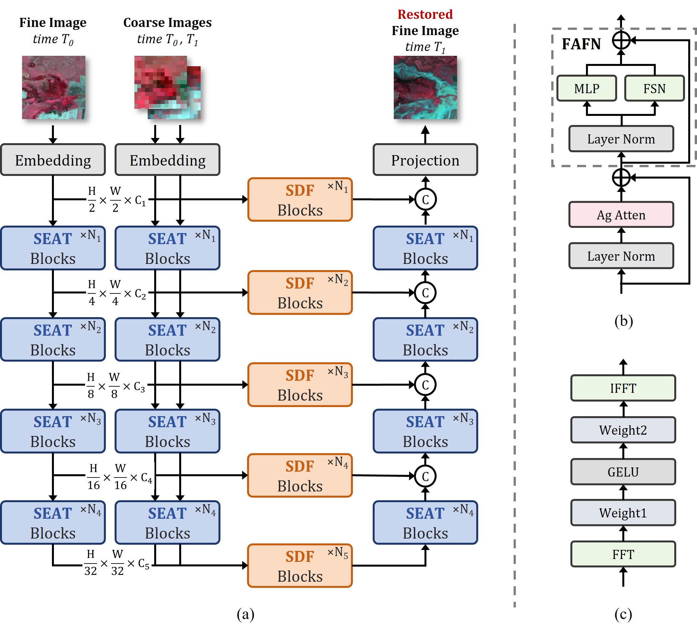

# FSDFormer
Code for [FSDFormer: a Frequency-Selected Differential Fusion Transformer for Remote Sensing Image Spatiotemporal Fusion](https://ieeexplore.ieee.org/abstract/document/11124232/)

## Model Architecture

<div align="center">
  
*Figure: Overall architecture of the FSDFormer model*</div>

## Project Structure

```
FSDFormer/
├── models/                 # Model definitions
│   ├── __init__.py
│   └── fsdformer.py       # Main FSDFormer model
├── datasets/              # Dataset handling
│   ├── __init__.py
│   ├── data_loader.py     # Data loading utilities
│   └── generate_t.py      # Temporal data generation
├── configs/               # Configuration files
│   └── config.yaml        # Training and model configuration
├── utils/                 # Utility functions
│   ├── loss.py           # Loss functions
│   ├── metrics.py        # Evaluation metrics
│   ├── optimizers.py     # Optimizer implementations
│   ├── schedulers.py     # Learning rate schedulers
│   ├── pytorch_ssim.py   # SSIM implementation
│   └── utils.py          # General utilities
├── experiments/           # Pre-trained models and experiments
├── show/                 # Visualization and results
├── train.py             # Training script
├── predict.py           # Prediction/inference script
└── requirements.txt     # Dependencies
```

## Installation

### Prerequisites

- Python 3.8+
- PyTorch 2.0.0+
- CUDA 11.8 (recommended for GPU acceleration)

### Install Dependencies

```bash
pip install -r requirements.txt
```

## Usage

### Data Preparation

```bash
python generate_t.py 
```

### Configuration

Modify `configs/config.yaml` to adjust model parameters, training settings, and dataset paths according to your requirements.

### Training

To train the FSDFormer model:

```bash
python train.py 
```

### Prediction

To generate predictions using a trained model:

```bash
python predict.py
```

## Model Weights

Pre-trained model weights are provided for quick inference and evaluation:
Pre-trained model weights are provided for quick inference and evaluation:
- Download `FSDFormer_Transformer_Daxing.pth` from Baidu Netdisk: [Link](https://pan.baidu.com/s/1WWPUsHWnt7_ugUEwvbmJZg?pwd=zzp9) (Extraction code: zzp9)
- Model weights trained on the Daxing dataset, ready for immediate use

## Citation

If you use this code in your research, please cite the original paper:

```
@article{lu2025fsdformer,
  title={FSDFormer: a Frequency-Selected Differential Fusion Transformer for Remote Sensing Image Spatiotemporal Fusion},
  author={Lu, Sichen and Jing, Juanjuan and Yang, Lei and Nie, Boyang and Feng, Lei and He, Xiaoying and Zhou, Jinsong},
  journal={IEEE Transactions on Geoscience and Remote Sensing},
  year={2025},
  publisher={IEEE}
}
```

## License

This project is for academic research purposes only.
